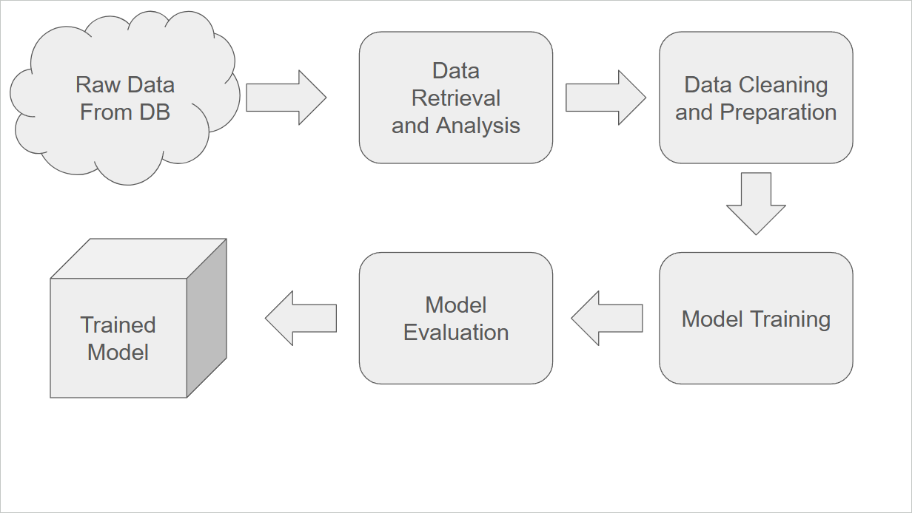
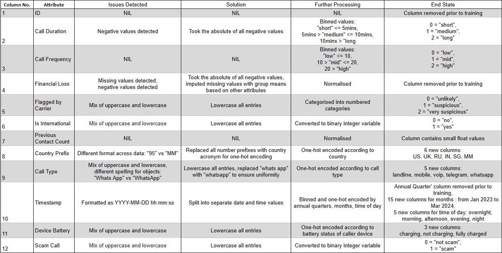

# AIAP Batch 17 Technical Assessment

## a. Personal Details
Name: Nicholas Daniel Phang Wei Li\
\
Email: nicholas.pwl@gmail.com

## b. Overview of Submitted Folder & Folder Structure

├── src\
│   └── main.py\
│   └── cleanupDataframe.py\
│   └── retrieveDataframe.py\
│   └── splitTrainingTest.py\
│   └── trainModel.py\
├── data (not included as requested)\
│   └── calls.db\
├── README.md\
├── eda.ipynb\
├── requirements.txt\
├── features.png\
└── run.sh

## c. Instructions to Execute Pipeline & Modify Parameters
To use this, navigate to the root folder and open the command line, then run ./run.sh.\
\
Users have the option of 'rf', 'dt', or 'all' to run the Random Forests model, Decision Tree model, or both respectively. The option is set to "all" by default". Users can also type 'help', run python3 src/main.py -h to see the available options.

## d. Description of Logical Steps of Pipeline

## e. Overview of Exploratory Data Analysis (EDA)
### Approach
Our approach is as follows: 
1. We will first check through the dataset and understanding what type of information we are being handed. We should be able to reason out what type of values to expect and hence detect any anomalous values.

2. We will first check for any missing values to be replaced or imputed. This will depend on the context of our missing values. Given that we have attributes that are based on time and location, we could look into those attributes to attain group means of any missing values instead of using an overall mean.  

3. During our data cleaning stage, we will attempt to resolve any other anomalous values that we encounter. This could include negative values in positive-only attributes, or strings in all-integer columns etc. For columns containing strings with a mix of uppercase and lowercase, we will convert all entries to lowercase to anticipate the such inconsistencies during the addition of future datasets. 

4. After cleaning, we will convert our attributes into formats that are of more meaningful use to us in the later stages of analysis and model evaluation. This will include one-hot encoding, normalising, converting to numerical categories etc.  

5. Once all the data have been cleaned and formatted respectively, we will then determine which attributes may or may not be included in the further analysis or model training. As mentioned, there may be synthetic features in the dataset that may have value in inferring other attributes but may not bear as much of a predictive quality on our label. We will remove these along with any other intermediary columns created in the cleaning and formatting stage, essentially preparing the data for model training. 

6. Finally we will run a correlation across the features and run our dataset through various ML models to assess which model would work best in our scenario. 

### Key Findings
1. Some attributes are not causal or predictive toward the label such as 'Financial Loss' and are thus not included in the training. 
2. Other attributes such as 'Timestamp' can be split into date and time to gather different insights on call patterns. However, we require a dataset spanning a longer time period to deduce annual seasonality as data only spans roughly 1.25 year's worth of records. 
3. 'Call Duration' only determined at the end of a given call, however this attribute allows us to assess any relationship duration of a call and likeliness of a scam call, such that our preventive SMS can be triggered once a suspicious call crosses a certain duration. 
4. 'Flagged by Carrier' is an interesting attribute as it contains the results of an external scam flagging method which we do not have access to at this point. While it can help us build upon existing scam detection means, it may also present an absorption of inherent biases into our model. Additionally, we use this as a benchmark for our models to determine if we are indeed able to achieve a better outcome using ML.

## f. Describe details of how features in the dataset are processed 

## g. Explanation of Choice of Models
Our target variable or label that we aim to predict is of a binary classification. Based on our knowledge of recommended models more suited for binary classification, we chose to run our data through the following ML models:

1. Random Forests
2. Decision Trees
3. k-Nearest Neighbour
4. Stochastic Gradient Descent
5. Logistic Regression
6. Support Vector Machine
7. Gaussian Naive Bayes

After tuning our hyperparameters, our findings show two particular models that seem to work best in this particular application - Random Forests and Decision Trees. We arrive at this conclusion by assessing the precisions and recalls of both models, after having filtered out other models based on accuracy alone. 

## h. Evaluation of Models Developed
We evaluate our selected models by looking at their precisions and recalls. Below is their significance in the context of our problem:
1. Precision: How many calls predicted to be scam calls are indeed scam calls?
2. Recall: How many actual scam calls were successfully predicted/identified?

When comparing our precisions and recalls to that of the carrier's current scam flagging methods, both models perform better, confirming our intention to improve on scam detection via ML. 

Comparing the two models, despite having a very similar accuracy, the differences in precision and recall indicate that Random Forests would be a better model to deploy. We have decided to select Random Forests as the primary model, and we have included Decision Trees as a secondary model in our MLP.
